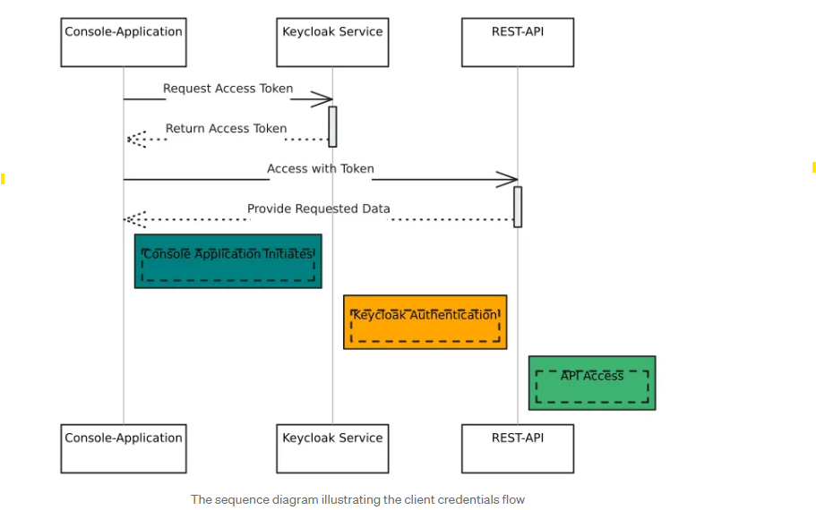

# keycloakServer
largely inspired by Mihaly Varga article https://medium.com/@mihlyvarga_55289/securing-net-core-applications-with-keycloak-implementing-client-credentials-flow-part-1-of-2-cb8d8e7eaed6

This project is a POC of Client Console Application that requests for access tokens from keycloak
and is now able to reach Rest API protected endpoints.

Console Application:

    - Can be front-end or any application that a user is using to call backend api
    - It does not have the resources/ Rest Api data but consumes
    - It can't directly make calls to the Rest API endpoints without requesting for access token from keycloak
    - Must be registered as a client on Keycloak first

Keycloak Server (Docker):
    
    -  Issues tockens
    -  Registers Clients

Web Api:

    - Protected by Keycloak
    - Gives Data from endpoints only to authorised Requests or clients
